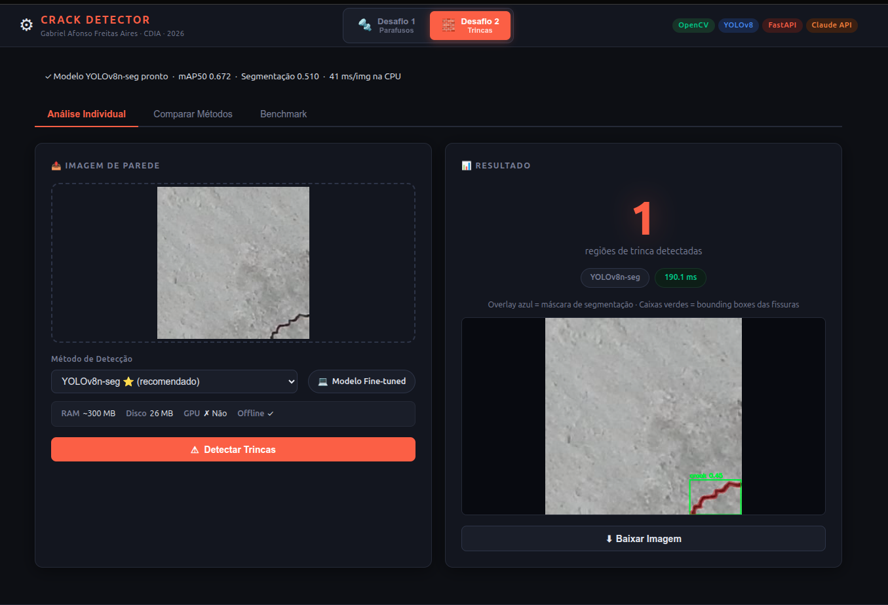
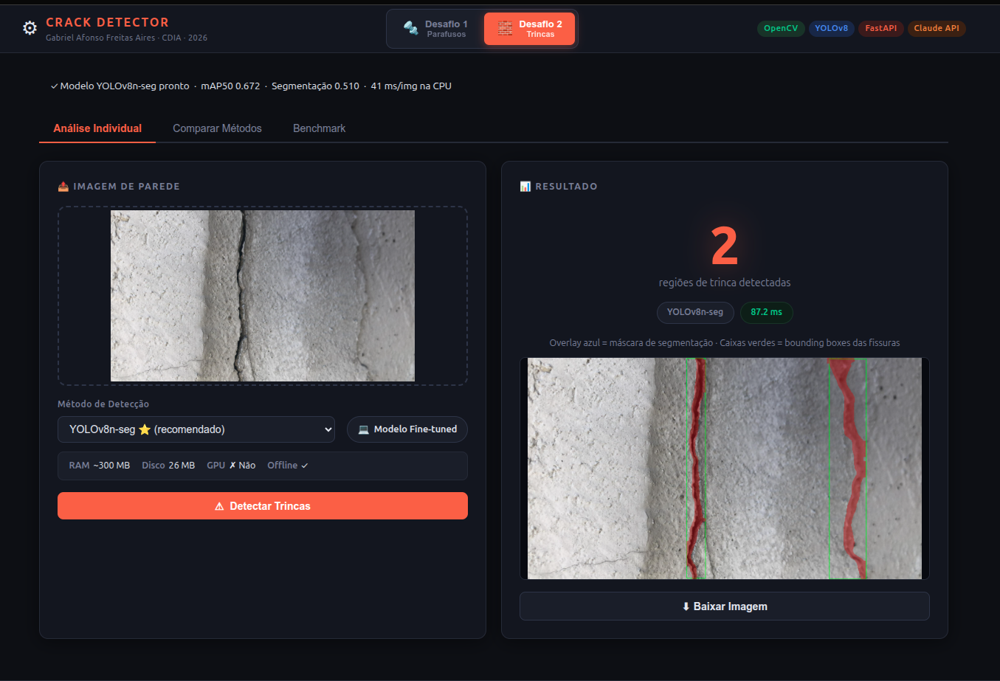
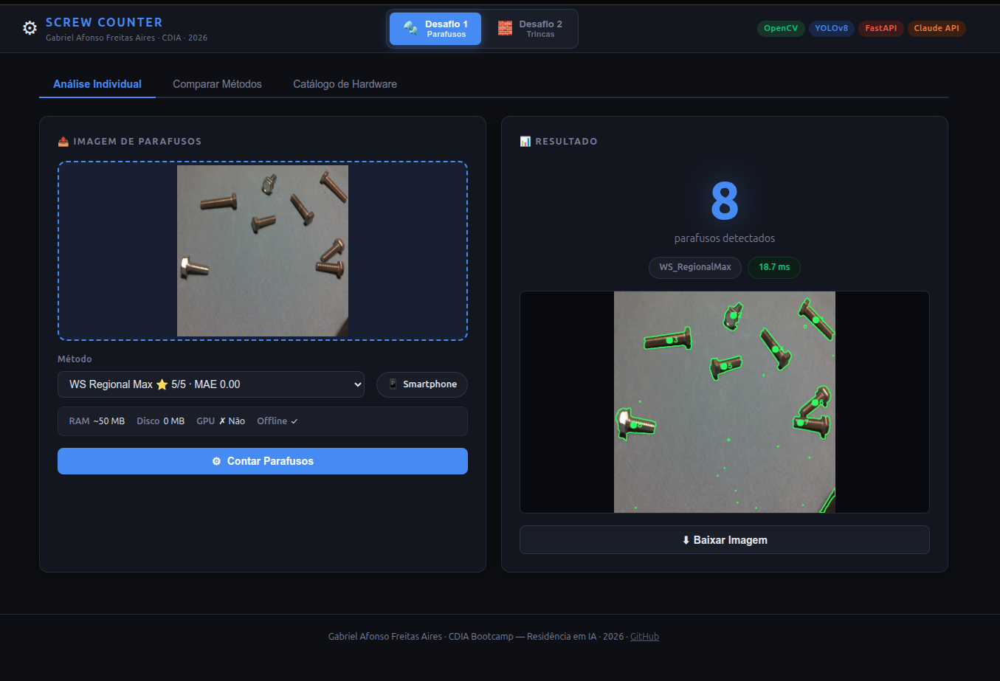
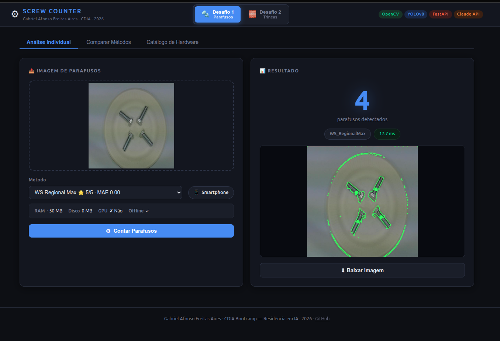
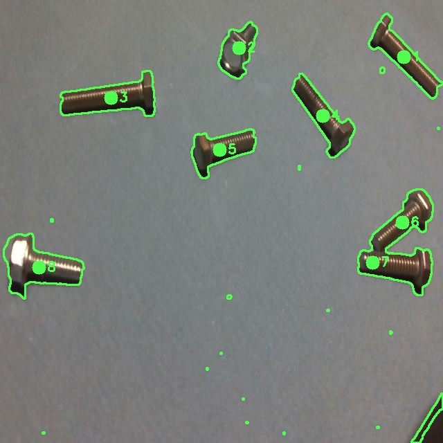
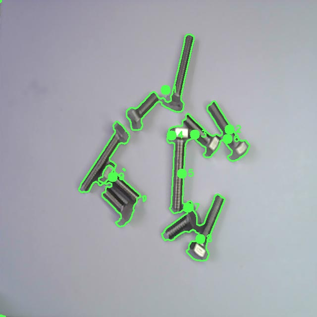
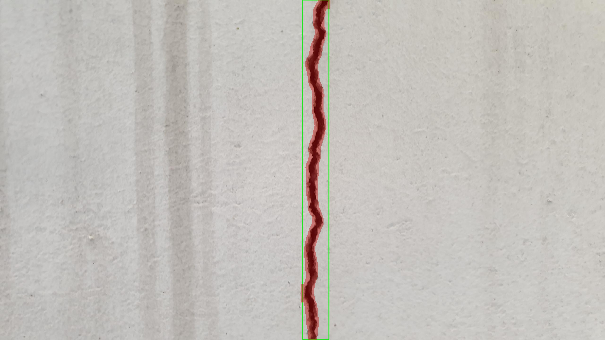
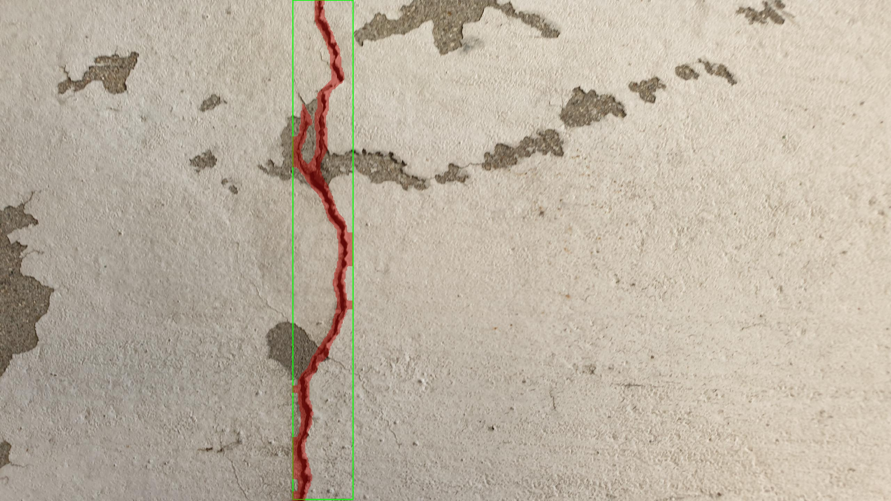

# CDIA Bootcamp — Residência em IA 2026

**Autor:** Gabriel Afonso Freitas Aires  
**Stack:** OpenCV · YOLOv8 · FastAPI · Claude API

Solução para os dois desafios do processo seletivo para a Residência em IA do CDIA. Interface web unificada com dois módulos independentes.

---

## Interface

**Desafio 2 — Crack Detector em funcionamento:** YOLOv8n-seg com overlay vermelho (máscara) e bboxes verdes

| Fissura com descascamento · 87ms | Fissura vertical densa |
|---|---|
|  |  |

**Desafio 1 — Screw Counter em funcionamento:**

| 8 parafusos espalhados · 16.7ms | 4 parafusos no prato · 17.7ms |
|---|---|
|  |  |

A aplicação roda em `http://localhost:8080` e permite alternar entre os dois desafios pelo seletor no header.

---

## Desafio 1 — Contagem de Parafusos

**Problema:** contar automaticamente parafusos em fotografias com fundo uniforme, incluindo parafusos sobrepostos em pilha.

**Solução vencedora:** `WS_RegionalMax` — Watershed com Regional Maxima do distance transform via `scipy.ndimage.maximum_filter`. Cada pico local no distance transform vira uma semente do Watershed, independente da altura absoluta — captura parafusos sobrepostos que o Watershed clássico perde.

### Resultados

| Método | Acertos | MAE | ms/img | Hardware |
|--------|---------|-----|--------|----------|
| **WS RegionalMax** | **5/5** | **0.00** | 8ms | Smartphone |
| Watershed | 4/5 | 0.60 | 7ms | Smartphone |
| Convex Defects | 3/5 | 0.60 | 9ms | Smartphone |
| CLIP + Regressor | 0/5 | 2.80 | 5231ms | GPU |
| FasterRCNN fine-tuned | 0/5 | 4.80 | 3075ms | GPU |

Benchmark completo com **24 métodos** em 4 tiers de hardware: Smartphone → CPU → GPU → Cloud API.

### Detecção em ação

| img1 — 8 parafusos espalhados | img5 — 9 parafusos sobrepostos (caso crítico) |
|---|---|
|  |  |

img5 é o caso diferenciador: parafusos amontoados em pilha. WS_RegionalMax é o único método clássico que acerta (9/9).

### Fine-tuning (aprendizado)

Foram testadas duas abordagens de fine-tuning, ambas inferiores ao método clássico:

1. **Dataset externo** (Cross-Recessed-Screw, GitHub, 900 imgs) — domain mismatch: parafusos em hardware eletrônico vs. fundo azul isolado. FasterRCNN fine-tunado resultou em 0/5.
2. **Dataset sintético gerado com LLM** — Claude Vision analisou as 5 imagens reais e extraiu parâmetros visuais precisos. Gerador procedural criou 1.680 imagens (25 base × 67 augmentações). Mesmo assim, domain shift residual impediu generalização.

**Conclusão:** com 5 imagens de referência, o método dedutivo (WS_RegionalMax) vence. Fine-tuning exigiria 100+ imagens anotadas no domínio correto.

---

## Desafio 2 — Detecção de Trincas em Paredes

**Problema:** detectar e segmentar fissuras em imagens de paredes, retornando localização exata (bounding box + máscara de segmentação).

**Solução:** YOLOv8n-seg fine-tuned em 1.240 imagens reais de paredes com trincas. O modelo **mostra onde está a fissura** — não apenas diz se existe.

### Resultados

| Método | mAP50 (seg) | Det% | ms/img |
|--------|------------|------|--------|
| **YOLOv8n-seg (final)** | **0.510** | — | **41ms** |
| YOLOv8n-seg (época 1) | 0.317 | — | 41ms |
| Canny + Morph | 0.161 | 96.7% | 309ms |
| Adaptive Threshold | 0.117 | 96.7% | ~180ms |
| Sobel + Otsu | 0.107 | 100% | ~150ms |
| Gabor Filter | 0.009 | 100% | ~220ms |

**3.2× melhor IoU** que o melhor método tradicional. mAP50(box) final: **0.672**.

### Detecção em ação — YOLOv8n-seg

Overlay azul-escuro = máscara de segmentação | Caixas verdes = bounding boxes

| Fissura vertical (parede clara) | Fissura estrutural com descascamento |
|---|---|
|  |  |

### Treinamento

O treino foi realizado integralmente em CPU (Intel i7-13650HX), sem GPU:

- **1ª rodada:** interrompida no epoch 4 por travamento do sistema. best.pt salvo.
- **Retreino:** 10 épocas partindo do best.pt da 1ª rodada. Convergência monotônica a partir da época 6.

| Época | mAP50 (box) | mAP50 (seg) |
|-------|------------|------------|
| 1 (1ª rodada) | 0.374 | 0.317 |
| 4 (1ª rodada, best) | 0.486 | 0.377 |
| retreino ep.8 | 0.629 | 0.522 |
| **retreino ep.10 (final)** | **0.672** | **0.510** |

### Pipeline de fallback

```
Imagem
  └→ YOLOv8n-seg (confiança ≥ 0.40) ✓ caminho principal
       └→ VLM Claude API (fallback cloud)
            └→ Canny + Morph (fallback offline)
```

---

## Estrutura do Projeto

```
cdia/
├── app.py                          # App FastAPI unificado (D1 + D2)
├── templates/index.html            # Interface web unificada
├── static/                         # CSS + JS do app unificado
│
├── desafio1/
│   ├── solution.py                 # Pipeline de contagem
│   ├── img1..img5.jpg              # 5 imagens do desafio
│   ├── RELATORIO.md                # Relatório técnico completo
│   └── benchmark/
│       ├── benchmark.py            # 24 métodos benchmarkados
│       ├── advanced_models.py      # OwlViT, CLIP, VLM
│       ├── finetune.py             # Fine-tuning FasterRCNN/CLIP/MobileNet
│       ├── generate_dataset.py     # Gerador de dataset sintético (LLM-guided)
│       ├── retrain_from_synthetic.py  # Retreino CLIP/MobileNet no dataset sintético
│       └── models/                 # Modelos fine-tuned salvos
│
├── desafio2/
│   ├── solution.py                 # Pipeline: YOLO → VLM → Canny
│   ├── train.py                    # Fine-tuning YOLOv8n-seg (50 épocas)
│   ├── post_train.py               # Validação + benchmark pós-treino
│   ├── scripts/
│   │   └── retrain_from_checkpoint.py  # Retreino emergencial a partir de checkpoint
│   ├── data.yaml                   # Config YOLO (1 classe: crack)
│   ├── RELATORIO.md                # Relatório técnico completo
│   ├── weights/best.pt             # Modelo treinado (26 MB)
│   └── benchmark/
│       └── benchmark.py            # 5 métodos vs YOLO
│
└── docs/screenshots/               # Imagens desta documentação
```

---

## Como rodar

```bash
cd cdia
pip install fastapi uvicorn opencv-python-headless scipy ultralytics torch torchvision

# Servidor unificado (D1 + D2)
python3 -m uvicorn app:app --host 0.0.0.0 --port 8080
# Acesse: http://localhost:8080
```

O modelo YOLOv8n-seg já está treinado em `desafio2/weights/best.pt`. Para retreinar:

```bash
cd desafio2
python3 train.py          # treino completo (50 épocas, ~8h CPU)
python3 post_train.py     # validação + benchmark pós-treino
```

---

## Endpoints da API

### Desafio 1 — Parafusos

| Endpoint | Método | Descrição |
|----------|--------|-----------|
| `POST /d1/count` | POST | Conta parafusos com método selecionado |
| `POST /d1/benchmark` | POST | Roda todos os métodos T1+T2 na imagem |
| `POST /d1/benchmark_gpu` | POST | Roda métodos T3 GPU |
| `GET /d1/hardware` | GET | Perfis de hardware de todos os métodos |

### Desafio 2 — Trincas

| Endpoint | Método | Descrição |
|----------|--------|-----------|
| `POST /d2/detect` | POST | Detecta trincas (YOLO ou método clássico) |
| `POST /d2/benchmark` | POST | Compara todos os métodos na imagem |
| `GET /d2/hardware` | GET | Perfis de hardware |
| `GET /d2/model_status` | GET | Verifica se o modelo está carregado |

---

*CDIA Bootcamp — Residência em IA · 2026*
